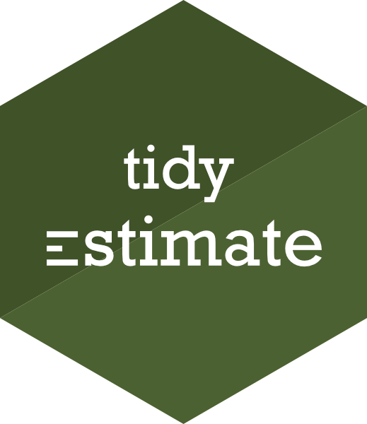
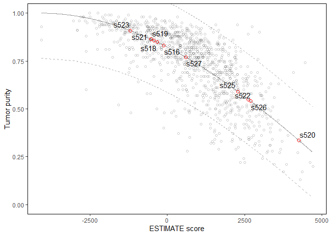

<!-- README.md is generated from README.Rmd. Please edit that file -->

# tidyestimate 

<!-- badges: start -->
<!-- badges: end -->

The ESTIMATE package has been fundamental for infering tumor purity from
expression data, but its documentation is lacking, and its functions
sometimes overstep their bounds while not doing enough. This package is
a refresh of ESTIMATE with the goal of maintaining the excellent
backbone of the package while increasing its documentation and function
scope.

## Installation

You can install the released version of tidyestimate from
[CRAN](https://CRAN.R-project.org) with:

``` r
install.packages("tidyestimate")
```

And the development version from [GitHub](https://github.com/) with:

``` r
# install.packages("devtools")
devtools::install_github("KaiAragaki/tidy_estimate")
```

## Features

|              |               tidyestimate               |  ESTIMATE   |
|-------------:|:----------------------------------------:|:-----------:|
|        input | `data.frame`<br />`tibble`<br />`matrix` | `.GCT` file |
|       output |               `data.frame`               | `.GCT` file |
| `%>%`/`\|>`? |                    ✔️                    |     ✖️      |
|         size |                 &lt;1MB                  |    \~7MB    |

Additionally:

⚡ Faster. `tidyestimate` doesn’t do any file conversion.

📝 Better documentation. Functions are more clear about input
requirements and returns.

🕊️ Lighter. Less code, more readable (less to break, easier to fix).

💪 Robust. `tidyestimate` does conservative alias matching to allow
compatibility with both old and new gene identifiers.

## Quickstart

Evaluating tumor purity with `tidyestimate` is simple. `tidyestimate`
can take a `matrix` or `data.frame` (and thus a `tibble`). In this
example, we’ll be using the `ov` dataset, which is derived from the
original `estimate` package. It’s a matrix with expression data
(profiled using an array-based Affymetrix method) for 10 ovarian cancer
tumors.

``` r
library(tidyestimate)
```

``` r
dim(ov)
#> [1] 17256    10
```

``` r
head(ov)
#>             s516    s518    s519    s520    s521    s522    s523    s525
#> C9orf152  4.8815  4.5757  3.7395  3.6960  4.1597  5.1162  5.2732  3.7492
#> ELMO2     7.2981  7.5554  7.5332  7.3824  7.3079  7.5172  7.5066  7.6513
#> CREB3L1   5.5692  5.7004  5.9597  5.7700  5.2190  5.9948  5.8476  5.7613
#> RPS11    13.3899 13.8488 13.6429 13.6546 13.5698 13.7516 13.8317 13.5906
#> PNMA1     9.3480 10.0092 10.4310  9.5399  9.6423  9.6793 10.2709 10.7222
#> MMP2      7.6182  8.0369  8.9551 10.3875  7.4141 10.3945  8.7918  9.8037
#>             s526    s527
#> C9orf152  5.3223  4.0155
#> ELMO2     6.9135  7.2543
#> CREB3L1   5.4605  5.5937
#> RPS11    13.7658 13.6895
#> PNMA1     9.0192  9.6915
#> MMP2      8.6792  6.4039
```

Tumor purity can be predicted like so:

``` r
scores <- ov |> 
  filter_common_genes(id = "hgnc_symbol", tell_missing = FALSE, find_alias = TRUE) |> 
  estimate_score(is_affymetrix = TRUE)
#> Joining, by = "hgnc_symbol"
#> Joining, by = "hgnc_symbol"
#> 461 of 488 missing genes found matches using aliases.
#> Joining, by = "hgnc_symbol"
#> 
#> Found 10364 of 10391 genes (99.74%) in your dataset.
#> Number of stromal_signature genes in data: 141 (out of 141)
#> Number of immune_signature genes in data: 141 (out of 141)
scores
#>    sample    stromal     immune   estimate    purity
#> 1    s516 -285.49841  165.75062  -119.7478 0.8323791
#> 2    s518 -429.16931   99.71302  -329.4563 0.8490421
#> 3    s519  -60.98619 -368.70314  -429.6893 0.8567232
#> 4    s520 1927.51431 2326.15984  4253.6742 0.3348246
#> 5    s521 -673.84954  141.72775  -532.1218 0.8643812
#> 6    s522 1447.95517 1166.51854  2614.4737 0.5497248
#> 7    s523 -271.15756 -928.44921 -1199.6068 0.9094242
#> 8    s525  965.61804 1310.27775  2275.8958 0.5905450
#> 9    s526  545.99467 2149.10473  2695.0994 0.5398002
#> 10   s527 -710.44370 1303.08009   592.6364 0.7699846
```

They can also be plotted in context of the Affymetrix profiled tumors
used to generate the ESTIMATE model:

``` r
scores |> 
  plot_purity(is_affymetrix = TRUE)
```

 A
more detailed version of this example can be found in the vignette of
this package.
